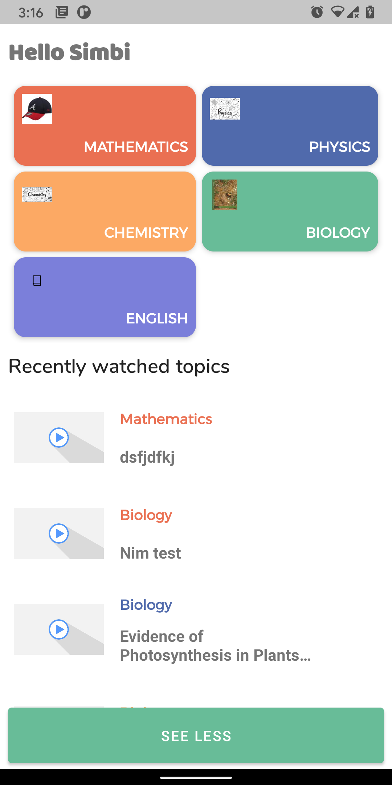

# Ulesson assessment app

## Architecture

- A single activity architecture making use of Android Jetpack's navigation.
- Makes use of Model-View-ViewModel pattern for separation of various app components.
- Uses modular app architecture that allows various parts of the app to be developed in isolation.

## Dependencies

- [Android Jetpack](https://developer.android.com/jetpack)
- [Material Components](http://material.io)
- [DaggerHilt](http://dagger.dev)
- [Timber](http://github.com/JakeWharton/timber)
- [Junit5](http://junit.org)
- [Coil](http://coil-kt.github.io)
- [Mockito](http://site.mockito.org)
- [Mockk](http://mockk.io)
- [Truth](http://truth.dev)
